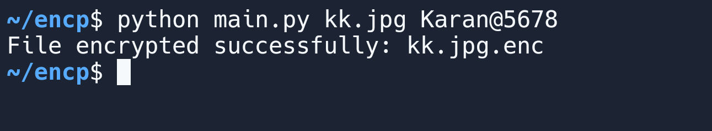

# KxFileCrypt

- Supports Python 3
- Name: KxFileCrypt
- Author: Karannkx

## Introduction
KxFileCrypt is a powerful Python-based utility designed to securely encrypt files using AES-256 encryption. By leveraging advanced cryptographic functions such as PBKDF2HMAC and handling cryptographic salts, this tool ensures that your files remain protected from unauthorized access and reverse engineering.



## Usage
1. Clone the repository.
2. Install the necessary dependencies.
3. Run the script with a command-line argument specifying the file to encrypt.
4. Your encrypted file will be saved with an "_enc" extension in the same directory.

## Features
- Utilizes AES-256 Encryption for maximum security.
- Employs PBKDF2 HMAC for secure password-based key derivation.
- Handles cryptographic salts to enhance security.
- Command-Line Interface for easy use directly from your terminal.

## Example
To encrypt a file using KxFileCrypt:

```bash
python encrypt_util.py --file yourfile.txt --password "YourSecurePassword"
```
## License
This project is licensed under the [MIT LICENSE](LICENSE).
